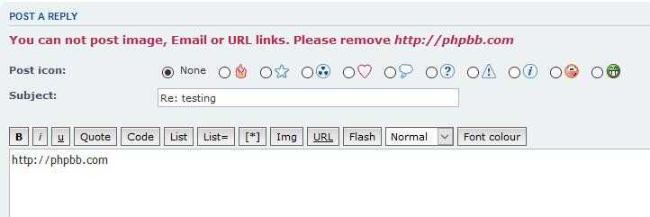

#  Authorized for Urls for phpBB3

phpBB extension that adds a new group/user permission which allows you to specify specific groups/users to disallow the posting of url links.

[](https://github.com/rmcgirr83/authorizedforurls/actions)



## Installation

### 1. clone
Clone (or download and move) the repository into the folder ext/rmcgirr83/authorizedforurls:

```
cd phpBB3
git clone https://github.com/rmcgirr83/authorizedforurls.git ext/rmcgirr83/authorizedforurls/
```

### 2. activate
Go to admin panel -> tab customise -> Manage extensions -> enable Authorized for urls
Within the Admin panel visit the Extensions tab and within choose the settings for the extension.

## Update instructions:
1. Go to your phpBB-Board > Admin Control Panel > Customise > Manage extensions > Authorized for urls: disable
2. Delete all files of the extension from ext/rmcgirr83/authorizedforurls
3. Upload all the new files to the same location
4. Go to your phpBB-Board > Admin Control Panel > Customise > Manage extensions > Authorized for urls: enable
5. Purge the board cache
